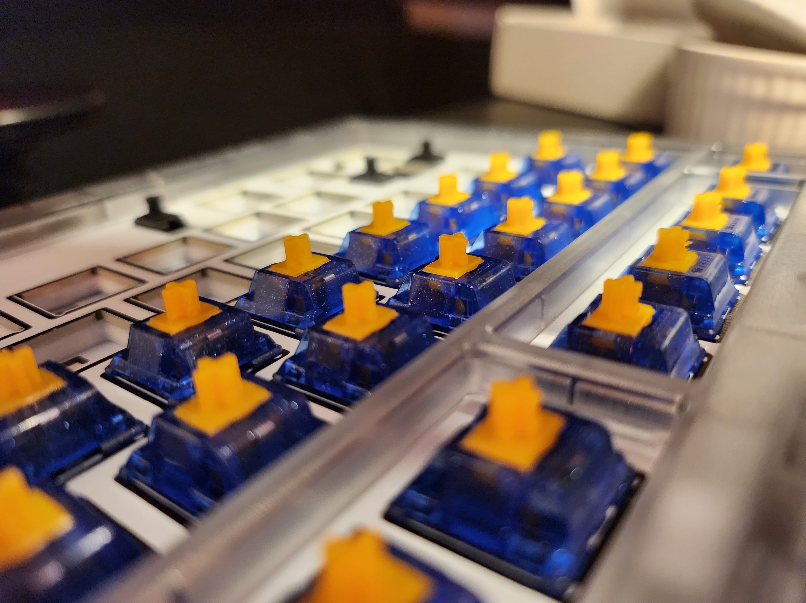
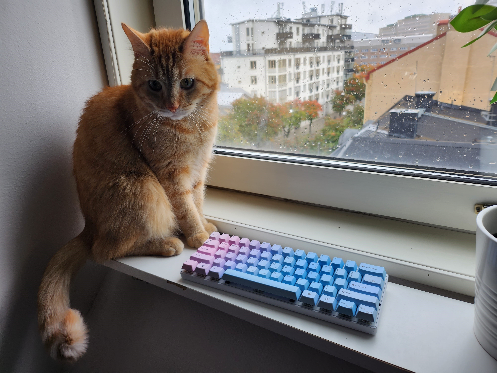

# keebs

I build keebs.

## [Portico75](https://thekey.company/products/portico75-smoke)

This is a fairly straight forward build. Fairly cheap as well. Would definitely recommend anyone interested in one of their boards.
I went with some fancy looking tactile Tecsee switches. I really like them but they're definitely on the heavier end of switches I'd use.

  
More images

  
  

| Part        |                                       Name                                       | Note    |
| :---------- | :------------------------------------------------------------------------------: | :------ |
| Switches    |           [Tecsee Sapphire 63.5g](https://switches.mx/tecsee-sapphire)           | Tactile |
| Keycaps     | [EPBT Milky & Purple](https://www.maxgaming.se/sv/keycaps/epbt-milkypurple-ansi) |         |
| Alternative |  [NicePBT Elderberry](https://mykeyboard.eu/catalogue/nicepbt-elderberry_6917/)  |         |

## [Kit Adam](https://kbdcraft.store/products/adam)

Fun and easy build! Loads of options here if you happen to have Legos at home. You can definitely make these your own. 
Honestly for being just plastic it sounds great.

  
More images

  

| Part        |                             Name                              | Note   |
| :---------- | :-----------------------------------------------------------: | :----- |
| Switches    | [Switch S² Engine](https://kbdcraft.store/products/switch-s2) | Linear |
| Keycaps     |   [Keycap OEM](https://kbdcraft.store/products/keycaps-oem)   |        |
| Alternative |                                                               |        |

## [Zoom TKL Essential Edition - Sky Blue](https://geekhack.org/index.php?topic=118490.0)

I've not received this one yet.

| Part        |                          Name                           | Note                                          |
| :---------- | :-----------------------------------------------------: | :-------------------------------------------- |
| Switches    |                                                         |                                               |
| Keycaps     | [GMK Shoko](https://thocstock.com/keycaps/gmk-shoko-r2) | Really expensive. Should probably buy clones. |
| Alternative |                                                         |                                               |

## [Vortex Pok3r](https://drop.com/buy/pok3r-rgb-backlit-mechanical-keyboard)

This is one of the oldest keebs I still own. Very loud blue switches and the stabs sounds absolutely awful.
The keycaps with the hangul legends looks great though.

  
More images

  
  

| Part        |                                      Name                                       | Note                                                                              |
| :---------- | :-----------------------------------------------------------------------------: | :-------------------------------------------------------------------------------- |
| Switches    |              [Cherry MX Blue](https://switches.mx/cherry-mx-blue)               | Clicky                                                                            |
| Keycaps     | [Hangul PBT Dye-Dubbed](https://drop.com/buy/hangul-pbt-dye-subbed-keycaps-set) |                                                                                   |
| Alternative |                                                                                 | [Wood chassi](https://drop.com/buy/datamancer-60-hardwood-magnetic-keyboard-case) |

## [Skyloong Epomaker SK61](https://www.amazon.se/gp/product/B08L4Q87VP)

This keyboard was a budget build, most things hunted down on amazon.
After some modding and extra padding it sounds and feels pretty good. 
The aluminium case ain't the sturdiest but this is a very cheap board. 
The Zilents are really nice. Clicky and nice but really not loud at all.
The clone keycaps look really nice as well.
Worth mentioning that the bluetooth never really worked for me in the long run.

  
More images

  

| Part        |                                     Name                                      | Note           |
| :---------- | :---------------------------------------------------------------------------: | :------------- |
| Switches    |                [Zilent V2](https://zealpc.net/products/zilent)                | Silent Tactile |
| Keycaps     | [JakeTsai PBT Honey Milk Clones](https://www.amazon.se/gp/product/B094Y5GB2Q) |                |
| Alternative |                                                                               |                |

## [Mistel Barocco MD600](https://mistelkeyboard.com/products/807a19ebcb8b2924891d471974d65438)

An older, white version without RGB and coiled cable. Normal red switches, fairly boring but good.

| Part        |                                           Name                                            | Note   |
| :---------- | :---------------------------------------------------------------------------------------: | :----- |
| Switches    |                    [Cherry MX Red](https://switches.mx/cherry-mx-red)                     | Linear |
| Keycaps     | [Sunzit PBT Blue w/ Japanese Legends Clones](https://www.amazon.se/gp/product/B09H2LTRB9) |        |
| Alternative |                      I've also got the original keycaps lying around                      |        |

## [Meletrix Zoom65 Olivia Light](https://cannonkeys.com/products/meletrix-zoom65)

| Part        |                       Name                       | Note |
| :---------- | :----------------------------------------------: | :--- |
| Switches    |   [JWK Black](https://switches.mx/jwick-black)   |      |
| Keycaps     | [GMK Olivia Light](https://www.oliviaplus.plus/) |      |
| Alternative |                                                  |      |

## [坂 Saka68 by CMM.Studio](https://candykeys.com/product/saka-65-keyboard-kit-white)

Not sure why I don't have more pictures of this one since it's my daily driver.
I love it. It's perfect. The original Gazzew Boba's are the perfect switches for me.

  
More images

  

| Part        |                                     Name                                     | Note                            |
| :---------- | :--------------------------------------------------------------------------: | :------------------------------ |
| Switches    |           [Gazzew Boba LT 55g](https://switches.mx/gazzew-boba-lt)           |                                 |
| Keycaps     | [ePBT Less, but better](https://candykeys.com/group-buys/epbt-lessbutbetter) | A bit too off-white to fit well |
| Alternative |                                                                              |                                 |
